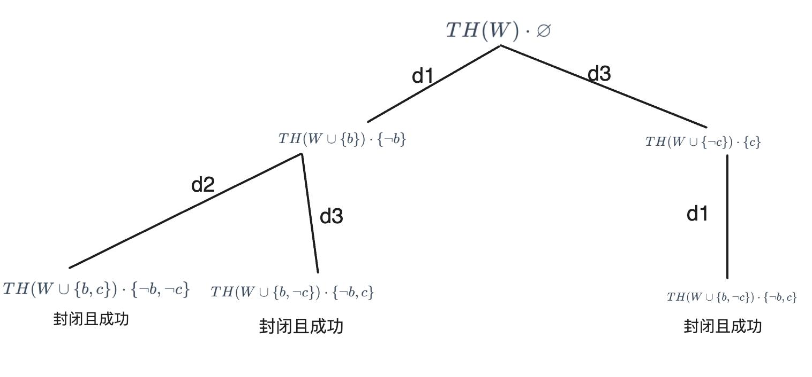

1.  

2.  $\mathcal{L}(\Pi_2) = \{F,G\}\cup\{f\}\cup\{a\}$
    $\text{HU}_{\Pi_2}=\{a,f(a),ff(a),\cdots\}$
    $\text{HB}_{\Pi_2}=\{F(a),G(a),F(f(a)),G(f(a)),F(f(f(a))),G(f(f(a))),\cdots\}$
    $M_{\Pi_2}=\varnothing$