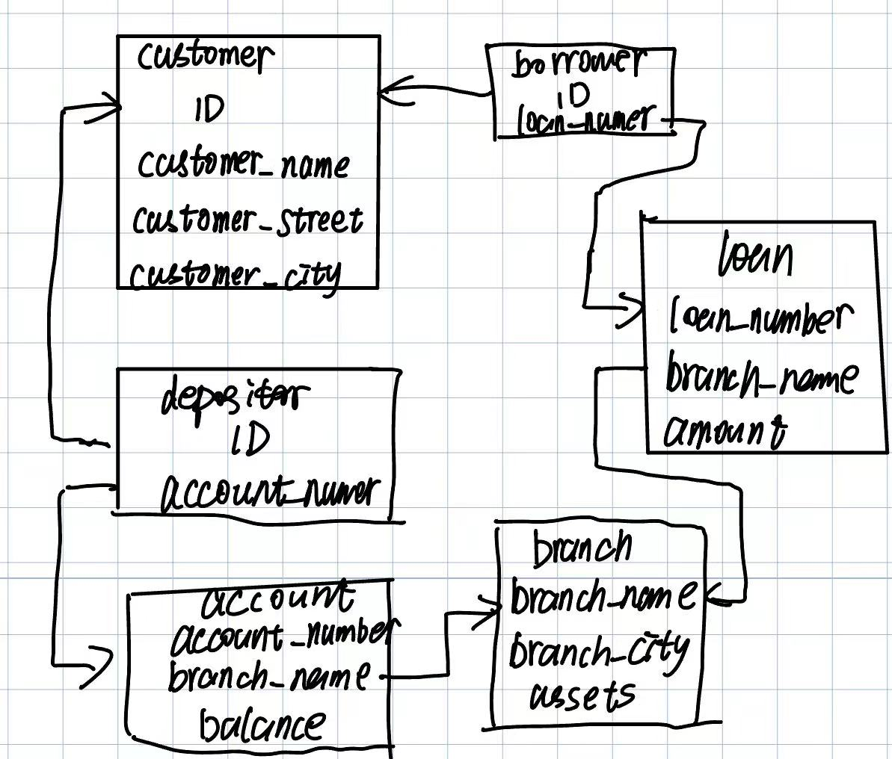

2.7
 
a. $\Pi_{branch\_name}(\sigma_{branch\_city = "Chicago"}(branch))$  
b. $\Pi_{ID}(\sigma_{branch\_name = "Downtown"}(loan \bowtie_{loan.loan\_number = borrower.loan\_number} borrower))$

2.12 
a. 

|Relation Name|Primary key|
|-------------|-----------|
|branch|branch_name|
|customer|ID|
|loan|loan_number|
|borrower|{ID, loan_number}|
|account|account_number|
|depositor|{ID, account_number}|

b. 
|Relation Name|Foreign key|
|-------------|-----------|
|branch|No Foreign Key|
|customer|No Foreign Key|
|loan|branch_name|
|borrower|**ID** - a foreign key referencing **customer** relation, **loan_number** - a foreign key referencing **loan** relation|
|account|branch_name|
|depositor|**ID** - a foreign key referencing **customer** relation, **account_number** - a foreign key referencing **account** relation|

2.13

2.15 

a. $\Pi_{loan\_number}(\sigma_{amount > 10000}(loan))$  
b. $\Pi_{ID}(depositor \bowtie_{depositor.account\_number = account.account\_number} (\sigma_{balance > 6000}(account)))$  
c. $\Pi_{ID}(depositor \bowtie_{depositor.account\_number = account.account\_number} (\sigma_{balance > 6000 \wedge branch\_name = "Uptown"}(account) ))$  