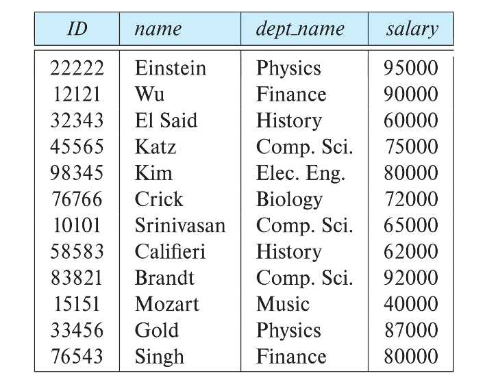

# Chapter2: Relation model

## Structure of Relational Databases

### 基本结构

>形式上说，给定集合$D_1,D_2,\cdots,D_n$，关系 r 是 $D_1\times D_2\times \cdots \times D_n$的子集。因此，一个关系是一个n元组$(a_1,a_2,\cdots,a_n)$的集合，其中$a_i\in D_i$

!!!example

    Example:  If
    name =  {Wu, Mozart, Gold, Singh, …}   set of all instructor names 
    dept_name =  {Music, Physics, Finance, …}  set of all department names
    salary    =  {40000, 80000, 87000,90000 …}  set of all salary 
    Then r = {(Wu,   Finance,  90000), 
    (Mozart,    Music, 40000),
    (Gold,    Physics, 87000),
    (Singh, Finance,  80000) }           
    is a relation over (name  x  dept_name  x  salary)
### 关系架构和示例 (Relation Schema and Instance)

+ $A_1,A_2,\cdots,A_n$是attributes（属性）
+ R = （A1, A2, …, An）是关系架构
  + 例如 instructor  = (ID,  name, dept_name, salary)
+ 在架构 R 上定义的关系实例 r 用 r （R） 表示。
+ 关系的当前值由表指定（由数据具体决定）
+ 关系 r 的元素 t 称为元组，由表中的一行表示

### Attributes (属性)

+ 每个属性的允许值集称为属性的 domain（定义域也叫域）
+ 属性值（通常）要求为 atomic（原子的）;也就是说，不可分割
+ 特殊值 null （空值） 是每个域的成员
+ 空值 null 会导致许多操作的定义复杂

### 关系是无序的    

这句话的意思是元组的顺序是无关紧要的，可以按照任意顺序存储。

### Database Schema

+ 数据库架构 -- 是数据库的逻辑结构。
+ 数据库实例 -- 是数据库中数据在给定时刻的快照。
  
!!! example
    schema:   instructor (ID, name, dept_name, salary)
    Instance:
    

### Keys(键)

+ Let $K \subseteq R $
+ K 是 superkey（超键） 如果对于每个关系实例 r，K 都能唯一标识 r(R) 中的元组
  + Example:  {ID} and {ID,name} are both superkeys of instructor.
+ Superkey K is a candidate key(候选键)  if K is minimal
  + Example:  {ID} is a candidate key for Instructor
+ One of the candidate keys is selected to be the primary key（主键）.

!!! note

    总结：超键--唯一识别性；候选键--最小超键；主键--候选键中选定；

+ Foreign key（外键） constraint  from attribute(s) A  of  relation r1 to the primary  key  B  of  relation r2 states that on any database instance, the value of A for each tuple in r1 must also be the value of B for some tuple in r2.**外键约束** 
+ Referential integrity(参照完整性) constraint  **完整性约束**

