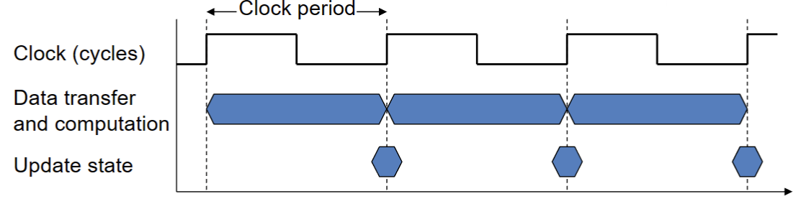
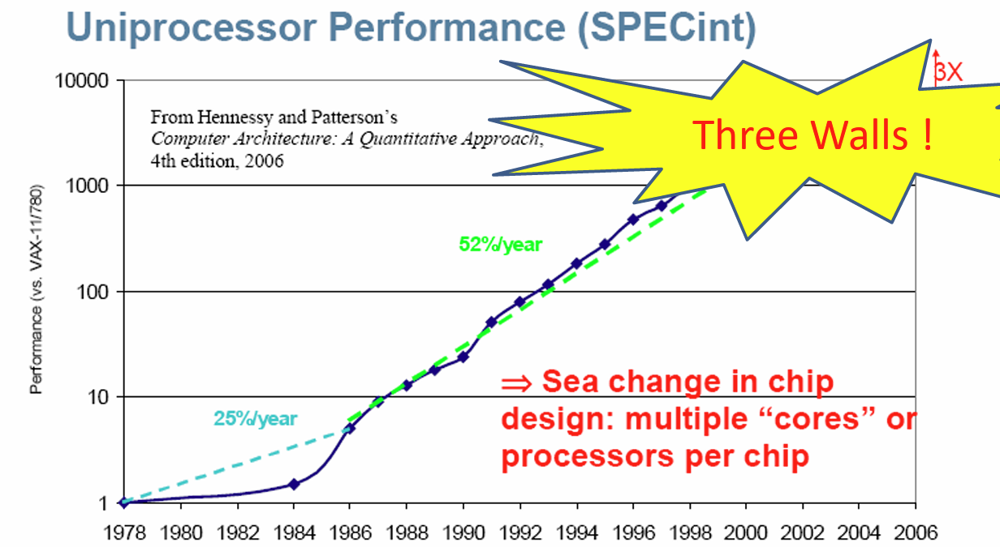

### CPU Clocking

+ 由恒定速率时钟控制的数字硬件的操作
+ 
+ Clock period: duration of one clock cycle
  + e.g. 250ps = 0.25ns = $250 * 10^-12$ s
+ Clock frequency(rate): cycles per second
  + e.g. 4.0GHz = 4000MHZ = $4 * 10^9$ Hz

### CPU Time

> CPU Time = CPU Clock Cycles * Clock Cycle Time
>          = CPU Clock Cycles / Clock Rate
提高运行效率的方法
  + 减少时钟周期数
  + 提高时钟频率
  + 硬件设计者必须经常权衡时钟速率和周期数

!!! example

    Computer A: 2.0GHz clock, 10s CPU time
    Design Computer B: 
        1. Aim for 6s CPU time
        2. Can do faster clock, but causes 1.2* clock cycles
    How fast must Computer B's clock be?
    > Clock Rate B = CPU Clock Cycles B / CPU Time B = 1.2 * Clock Cycles A / 6s
    > Clock Cycles A = CPU Time A * Clock Rate A = 10s * 2.0GHz = 20 *10^9
    > Clock Rate B = 1.2 * 20 * 10^9 / 6s = 4.0GHz

## 1.7 性能的飞速增长

   
存在三个性能增长限制因素：

#### Power Wall
+ 工作频率每增加一倍，功耗就增加一倍；发热严重；泄漏电流

In CMOS IC Technology
> $Power = Capacitive\;load * Voltage^2 * Frequency$

##### 减少功耗  

假设一个新CPU：
+ 85% of capacitive load of old CPU
+ 15% voltage and 15% frequency reduction
+ $\dfrac{P_{new}}{P_{old}}= \dfrac{C_{old}*0.85*(V_{old}*0.85)^2*F_{old}*0.85}{C_{old}*V_{old}^2*F_{old}}=0.85^4=0.52$

限制功耗的因素
+ 不能再减小电压（否则泄露电流过多）
+ 也不能再减少发热

#### Memory Wall

Memory 的性能增长不如 CPU 的性能增长，大部分时间花在读写内存了，影响整体性能。

#### ITP Wall

并行的目的就是不让CPU空闲，但实际情况上很难找到足够的并行程序来让CPU持续工作；即指令集的并行程度。  

### Amdahl's Law

>Improve an aspect of a computer and expecting improvement in overall performance.提升计算机的某个方面对整体性能的提升

$$
T_{\text{improved}} = \dfrac{T_{\text{affected}}}{\text{improvement factor}} + T_{\text{unaffected}}
$$

单独对某一方面提升，不能使整体获得同样幅度的提升

Corollary: make the common case fast.

机器在不工作的时候也有功耗的存在。

+ MIPS as a Performance Metric
  + MIPS: Millions of Instructions Per Second
  + 这个参数需要在其他参数一致时，才有比较意义。不同的 ISA 之间不能仅凭 MIPS 比较。