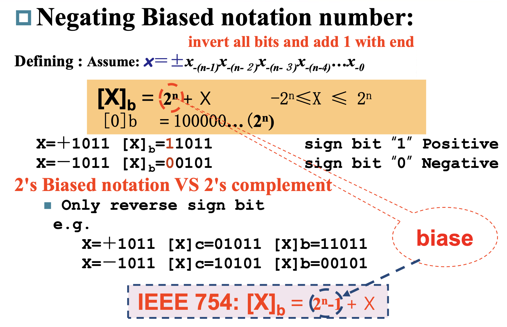

## 1.Introduction

Instructions can be divided into 3 categories
+ memory-reference instructions: lw, sw 读取和存储(load word，stop word)
+ arithmetic-logical instructions：e.g. add, sub, and, or, xor, slt(比较指令) 需要 ALU 进行计算
+ control flow instructions：e.g. beq, bne, jal;分支指令，跳转指令，也要用到 ALU

## 数的表示(Numbers)

### 有符号数和无符号数(sign and unsigned numbers)

+ 无符号数：unsigned number 所有的位数都代表着实际大小的数值，n位二进制数表示范围是：$0 \to 2^n-1$
+ 有符号数：一般是最高位表示符号，0为正，1为负。n位二进制数表示范围是：$-2^{n-1} \to 2^{n-1}-1$
  + $(1000 0000)_2 = -128$
  + $(0111 1111)_2 = 127$
+ 补码和反码：
  + 1‘s complement: 反码，符号位不变，其余位取反
  + 2‘s complement: 补码，符号位不变，其余位取反加1  
+ Two‘s Biased notation
  + $[x]_b = 2^n + x$
  + 需要这一移码的原因是希望比较大小的时候，可以直接比较二进制数的大小，带着符号位比较。
  

### 位扩展(Extension)

+ 位扩展：将低位的符号位扩展到高位，保持数值不变

## Arithmetic(算术运算)

+ Addition：直接加
+ Subtraction
  + 直接减
  + 加上 2‘s complement
+  overflow：溢出