# 红黑树和B+树

## 红黑树

> 本质上仍是平衡二分查找树，与splay树不同的是红黑树可以保证每次操作都是$O(logn)$ 的时间复杂度。它引入了新的性质：颜色，即红黑两色。
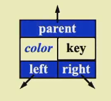

!!! note

    为了防止访问空节点，我们让树的所有叶子节点都指向一个虚拟节点，这个节点的值可以是零值或者一个特定的可以判断的值。这种情况的好处是，我们不需要对每次访问的节点进行判空操作，这样使得叶子节点也可以访问其左右儿子。这种外部节点被称为哨兵（NIL） 。

### 定义

红黑树是一种二分搜索树，满足以下性质：

1. 每个节点要么是红色，要么是黑色。
2. 根节点是黑色。
3. 每个叶子节点（NIL）是黑色。
4. 如果一个节点是红色，那么它的两个儿子都是黑色。
5. 对于每个节点，从该节点到其所有后代叶子节点的简单路径上，均包含相同数目的黑色节点。

黑高（Black-height）：对任何一个节点x，从该节点（不包含x）到其后代叶子节点（NIL）的简单路径上的黑色节点的个数称为该节点的黑高。bh(Tree)=bh(root)。计算黑高的时候不用考虑NIL节点。

!!! example

    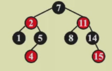
    在上图中，bh(1)=0,bh(4)=0,bh(11)=1,bh(7)=1.

**[Lemma]**：一棵有n个内部节点的红黑树的高度至多为$2log(n+1)$。

**[Proof]**：对任意节点x，$\text{sizeof}(x)\geq 2^{bh(x)}-1$。使用归纳法证明。
如果h(x)=0，那么$\text{sizeof}(x)= 2^0-1=0$。显然成立。
假设对任意$h(x)\leq k$都成立：
对于h(x)=k+1，bh(child) = bh(x) or bh(x) - 1 
由于$h(child)\leq k$，由归纳假设，我们有
$\text{sizeof}(child)\geq 2^{bh(child)}-1\geq 2^{bh(x)-1}-1$。
因此$\text{sizeof}(x)=1+2\text{sizeof}(child)\geq2^{bh(x)}-1$.

再者，$bh(Tree)\geq h(Tree)/2$
因此，$\text{sizeof}(x)\geq 2^{h(Tree)/2}-1$，即$h(Tree)\leq 2log(\text{sizeof}(x)+1)$。    

### 操作

#### 1.插入

Idea：如果插入的都是红色的，那么性质5将始终满足，所以考虑插入红色节点。

现在我们已经插入了红色的节点，如果没有违反性质4，那么红黑树仍然是平衡的，如果出现了违反性质四的情况，我们按以下情况进行讨论：

**Case1：** 插入节点的叔叔是红色的，那么我们把祖父的黑色传给叔叔和父亲，祖父变成红色，这是一种“甩锅”的操作，把问题交给祖父。
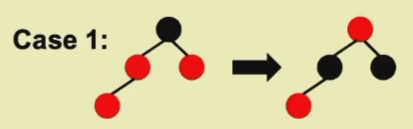
**Case2：** 插入节点的叔叔是黑色的，那要先看叔叔和插入节点的关系，如果是近叔叔的话，就先做一次旋转，把它提起来。就变化成了第三种情况。
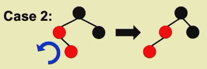
**Case3：** 插入节点的叔叔是黑色的，且插入节点是远叔叔的话，那么就先把父亲的红色给爷爷，但这让左边的黑高增加了，因此需要把右边旋转，把父亲提起来，就满足了性质四和性质五。
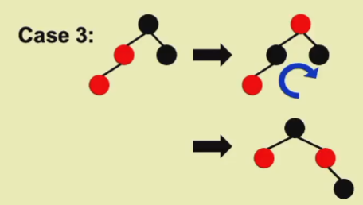

除此以外还有对称的情况

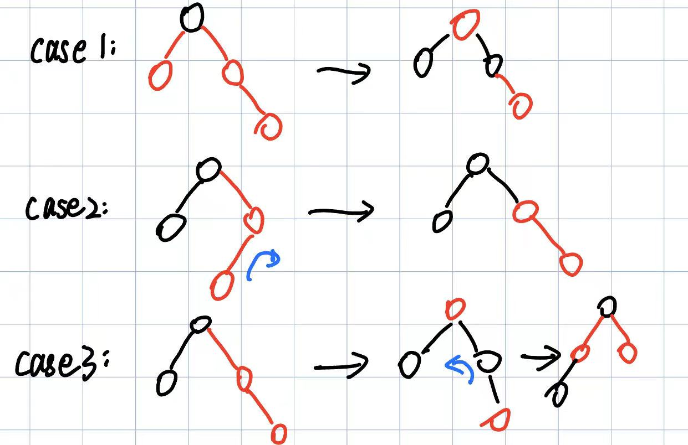

!!! note
    
    近叔叔是指两个节点都是左（右）儿子，远叔叔是指两个节点一个是左儿子一个是右儿子。

时间复杂度：Case2、3都是$O(1)$的操作，Case1是要迭代的，时间复杂度是$O(h)=O(logn)$的。

操作可行性的证明：

在Case1中有以下定义：
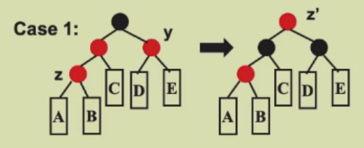
这种迭代当z.p为黑色的时候结束。在这个过程中，有如下性质： 
1. 节点z是红色的，问题就是它引起的。
2. 如果z.p是根节点的话，就把他变为黑色的，那么迭代就结束了。
3. 只有性质2或性质4中的一条会被破坏。
4. A、B、C、D、E的根节点都是黑色的。
5. 并且他们的黑高都是一样的。

#### 2.删除

!!!info

    先回忆一下BST的删除：
    
    1. 如果z没有儿子，那么直接删除z。
    2. 如果z只有一个儿子，那么用z的儿子替换z。
    3. 如果z有两个儿子，那么找到z的左子树中最大的或者右子树中最小的来替换z。
       
    这三者的共同点是：都可以看作是替换后删除叶子节点。

接下来看红黑树的删除操作：

1. 如果z没有儿子（即z是NIL），那么将它的父亲连接到NIL上。
2. 如果z只有一个儿子，那么用z的儿子替换z，但是替换的只是键值，颜色不变。
3. 如果z有两个儿子的话，也是找到z的左子树中最大的或者右子树中最小的来替换z，仍然是替换键值，不改变颜色。

也都是替换后删除叶子节点（儿子都是NIL），那么这就会涉及到替换后的叶子是什么颜色的情况了。如果是一个红色节点的话，那么删除并不会破坏性质5。如果是黑色的话，我们就需要进行调整。 

如果删掉了一个黑色的节点，那么必然会导致黑高不平衡，违反性质5。那我们一定要想办法替换这个黑色。
现在一个直观的想法是，我们定义节点的颜色字段：红色为0，黑色为1；那么这个多出来的黑色就是一个颜色字段+1的操作。
一般而言（算法分析的一个套路）我们加到聚焦的对象要删掉的X上。这样就可以保证性质5不被破坏。但是性质1却被破坏了。我们现在要考虑如何解决这个多的黑的debuff。
与刚才插入甩锅的想法类似，我们希望把这个黑色向上传递，如果刚好父亲是一个红色的，那么他变成黑色的，就完成任务了。如果父亲是个黑色的，那么就继续做向上传的操作，继续甩锅。如果传递到了根节点，那么由于是根节点有两个黑色，并不会影响任何一个黑高，所以就直接删掉就可以了。所以现在要考虑的就是如何把这个黑色传给父亲或者爷爷。
如果直接传的话，那么黑高就会不平衡，一定要带着兄弟节点一起传才行。
如果兄弟是红的，那么我们就要想办法把兄弟变黑，就是以下的第一种情况。
**Case1：** x是两个黑度，兄弟是红色的，那么把红色传给父亲，这时候两边黑高就不一样了，兄弟这边的黑高就更高了，所以把兄弟拎起来，如果兄弟有儿子，那儿子（哨兵或内部节点）一定是黑的（性质4）。那么我们就完成了把黑侄子变成兄弟的操作，现在兄弟也是黑的了。
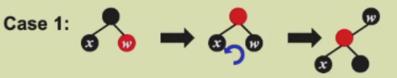
那么有现在这样的结果以后，我们在往上甩锅的过程中会遇到以下三种情况：
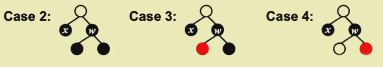
**Case2：** x是两个黑度，兄弟是黑色的，两个侄子也都是黑色的。那么我们就可以直接向上传递，把x的一个黑和兄弟的黑都传给父亲，如果父亲本来是红色的，那么父亲变黑，任务完成；如果父亲是黑色的，那么继续向上传递。
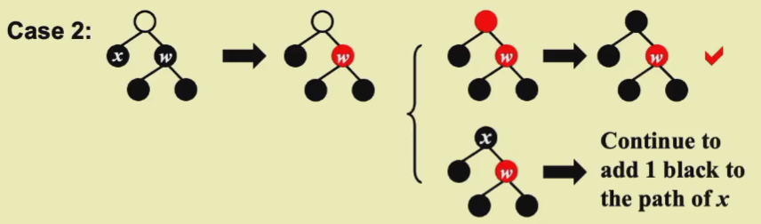
**Case3：** x是两个黑度，兄弟是黑色的，两个侄子不全是黑色的。我们要看远侄子的情况，此时远侄子是黑色的，那么近侄子一定是红色的。现在把近侄子的红色跟兄弟的黑色交换，那么兄弟子树内的黑高就不对了，需要把近侄子拎起来，那么结果就是获得了一个红的远侄子。就转化为了下面的Case4。
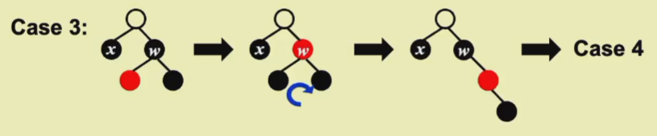
**Case4：** x是两个黑度，兄弟是黑色的，远侄子是红色的，近侄子的颜色无所谓。操作是：把父亲和兄弟的颜色交换，把远侄子染黑，然后把兄弟拎起来。这时候计算一下黑高，父亲的左边黑高是X的2点，右边的黑高应该是1点（性质5），因此近侄子的黑高是0点，远侄子的黑高本来也是0点，染黑了以后变成了1点。那么旋转以后，左边黑高就还是1点，右边黑高就是侄子染黑后的一点，而我们的x是要被干掉的，所以两边的黑高就平衡了。
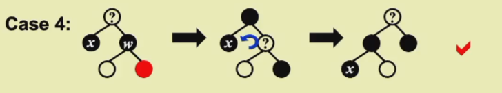

!!! example

    

AVL树与红黑树的对比：

| 旋转次数  | AVL         | 红黑树  |
| --------- | ----------- | ------- |
| Insertion | $\leq2$     | $\leq2$ |
| Deletion  | $O(\log N)$ | $\leq3$ |

