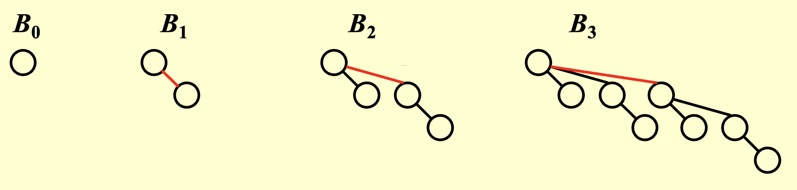
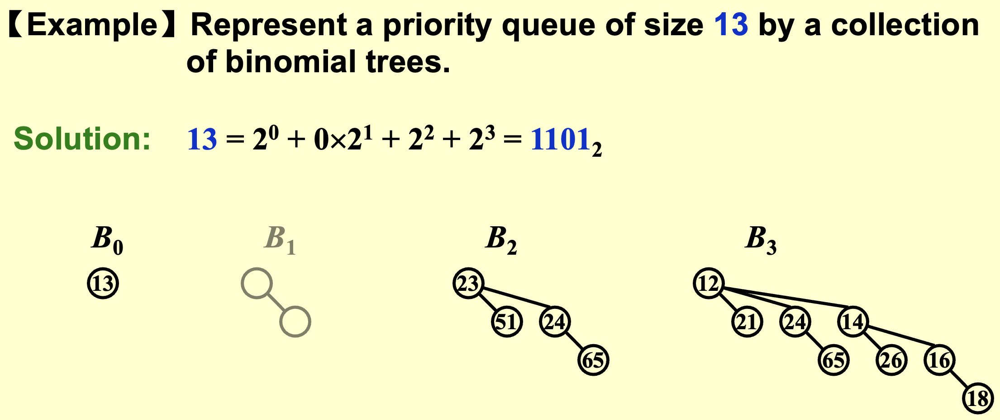
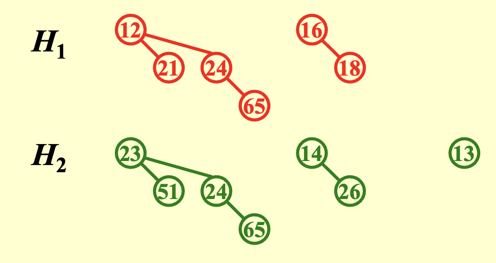
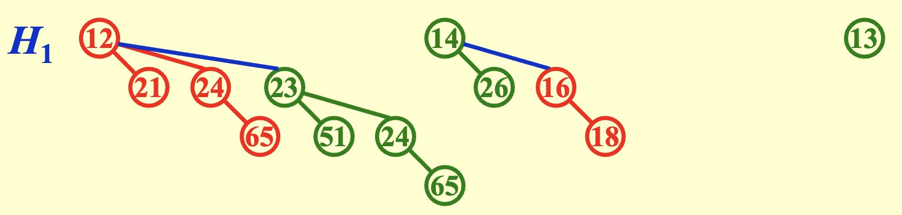
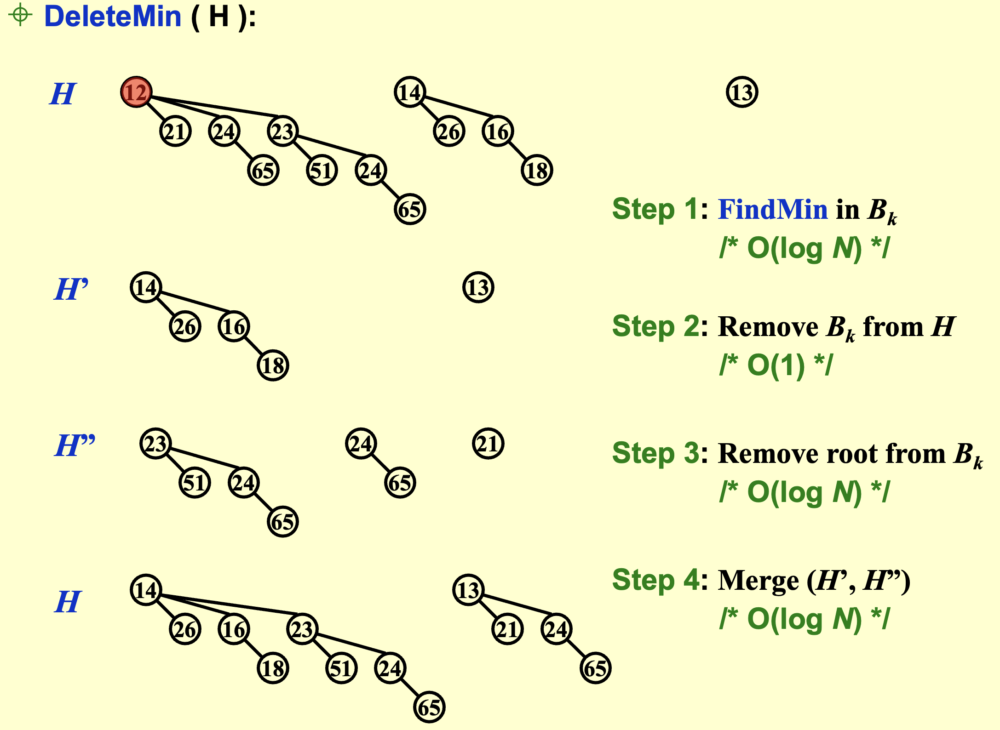

# Binomial Queue（二项队列）

## structure

二项队列不是单独一个heap-ordered tree，而是由多个heap-ordered tree组成的。其中每一个heap-ordered tree都是一个binomial tree。

A binomial tree of height 0 is a one-node tree.
A binomial tree, $B_k$ of height k is formed by attaching a binomial tree $B_{k-1}$ to the root of another binomial tree $B_{k-1}$.

!!! note

    $B_k$ consists of a root with **k** children, which are $B_0,B_1,\cdots,B_{k-1}.$
    $B_k$are exactly $2^k$ nodes.
    The numbers of nodes at depth d is $\binom{k}{d}$.

$B_k$ structure + heap order + one binomial tree for each height
$\Rightarrow$ 任何大小的优先队列都可以唯一地用二项树的集合表示（二进制表示唯一）

!!! example

    

智云10:30

## Operations

### Findmin

The minimum key is in one of the roots
There are at most $\lceil\log N\rceil$ roots, hences $T_p = O(\log N)$

!!! note

    We can remember the minimum key in the root of the tree, and update it whenever it is changed.Then the operation will take $O(1)$.

### Merge

$T_p=O(\log N)$

### Insert

a special case of merge

## Implementation

Binomial queue = array of binomial trees
智云11：34

## 均摊分析